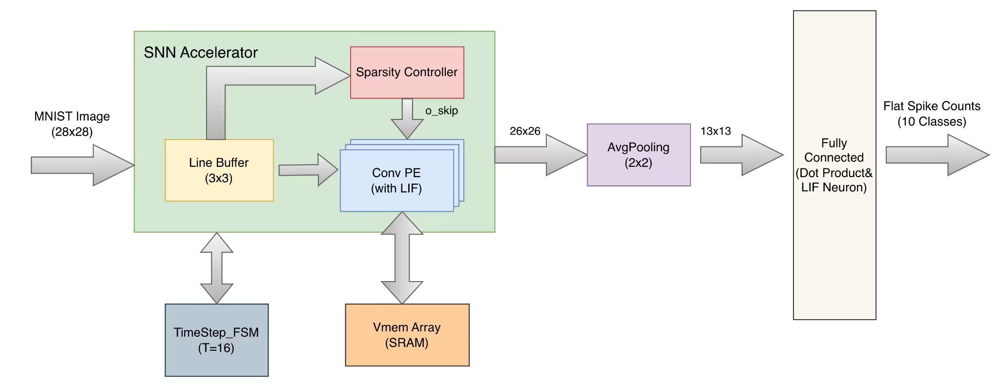

# MNIST Spiking Neural Network (SNN) Accelerator

A custom RTL implementation of a Spiking Neural Network (SNN) designed for MNIST handwritten digit classification. Built in SystemVerilog, this hardware accelerator achieves **92% accuracy** on a 100-image hardware simulation batch (98% PyTorch baseline; gap due to INT8 quantization on borderline cases).

## 💡 Key Features
- **Multiplier-less LIF Neuron**: Replaced the membrane potential decay factor with an arithmetic right shift (`>>>`), eliminating power-hungry hardware multipliers.
- **Sparsity-Aware Computing**: Dynamically detects zero-input windows to skip redundant MAC operations, maximizing energy efficiency.
- **Hardware-Friendly Data Flow**: Utilizes a Channel-Last (HWC) weight permutation and a custom 3x3 `LineBuffer` for real-time spatial convolution.
- **State Retention**: Preserves neuron membrane potentials across $T=16$ time steps using a distributed SRAM array (`Vmem_Array`).

## 🏗️ Architecture



## 📂 Repository Structure
- `rtl/`: SystemVerilog source files (PE, Pooling, LineBuffer, FSM, etc.).
- `sim/`: Testbenches for unit and batch testing.
- `scripts/`: Python scripts for PyTorch model training, quantization, and verification.
- `data/`: Extracted INT8 weights (`.hex`) and test images.
- `asic/`: RTL-to-GDSII flow using OpenROAD + SKY130HD 130nm PDK.

## 🔬 ASIC Implementation (SKY130HD)

Full RTL-to-GDSII flow completed with OpenROAD on the SkyWater SKY130HD 130nm PDK.

### Timing & Area

| Metric | Value |
|--------|-------|
| Achieved Fmax | **59 MHz** (target: 50 MHz) |
| Setup WNS | **+2.12 ns** — 0 violations |
| Hold WNS | **+0.01 ns** — 0 violations |
| Core area | **8.875 mm²** @ 62% utilization |
| Standard cells | 362,933 (125,349 sequential) |
| DRC violations | **0** |

### Performance & Power

| Metric | Value | Notes |
|--------|-------|-------|
| Throughput | **~4,703 img/s** | 59 MHz / (16 frames × 784 pixels/frame) |
| Latency | **~213 μs/image** | 16 × 784 cycles @ 59 MHz |
| Total power | **452 mW** | @ 59 MHz, SKY130HD 130nm — with clock gating |
| Energy/inference | **~96 μJ** | 452 mW / 4,703 img/s |
| Conv MACs/image | **~869,504** | 8 filters × 9 taps × 676 pixels × 16 frames |
| Sparsity saving | **~40–50%** | Zero-window skip via SparsityController |

> **Clock gating impact**: Adding ICG cells on Vmem_Array write path and ConvPE output registers reduced total power by **51%** (931 mW → 452 mW) with negligible area overhead. Fmax reduced slightly (62 → 59 MHz) due to ICG latch delay in the clock path.
>
> Note: Power is dominated by 362K standard cells at 130nm. At modern process nodes (e.g., 7nm), power would scale by ~100×.

See [`asic/README.md`](asic/README.md) for full setup instructions and [`asic/reports/6_report_clockgating.json`](asic/reports/6_report_clockgating.json) for complete metrics.

## 💡 RTL/ASIC Design Highlights
- **Clock Gating**: Explicit ICG cells (`rtl/cells/ClockGate.sv`) on Vmem write-path (8 × 676 FFs) and ConvPE output registers — zero dynamic power when idle
- **DFT Ready**: `scan_en / scan_in / scan_out` ports on `Top_System` for ATPG scan-chain insertion
- **SVA Assertions**: 9 concurrent properties (`ifdef FORMAL`) targeting ConvPE, LineBuffer, TimeStep_FSM — compatible with SymbiYosys bounded model checking
- **AXI4-Lite Wrapper**: `SNN_AXI_Wrapper.sv` packages the accelerator as a drop-in SoC IP block
- **Pipelined FC MAC**: 1-cycle pipeline register breaks the 80-multiply combinatorial path in FullyConnected

## 🚀 Quick Start

```bash
make verify   # train → export weights → compile → simulate → check accuracy
make formal   # run SymbiYosys formal verification (requires sby)
make clean    # remove all generated artifacts
make help     # show all targets
```

### Manual flow
```bash
# 1. Train model and export quantized weights
python3 scripts/snn.py
python3 scripts/export_parameters.py

# 2. Compile RTL (iverilog 12+)
iverilog -g2012 -DSIMULATION -o snn_sim \
  sim/tb_Batch_Test.sv \
  rtl/cells/ClockGate.sv \
  rtl/top/SNN_Accelerator.sv rtl/top/Top_System.sv \
  rtl/core/*.sv rtl/memory/*.sv

# 3. Run simulation and verify accuracy
vvp snn_sim
python3 scripts/verify_hw.py

# 4. Formal verification (install SymbiYosys first)
# conda install -c litex-hub symbiyosys bitwuzla
sby -f formal/snn_formal.sby
```